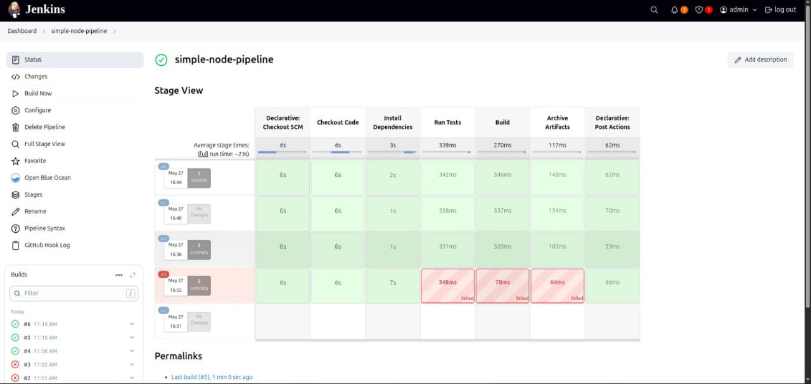
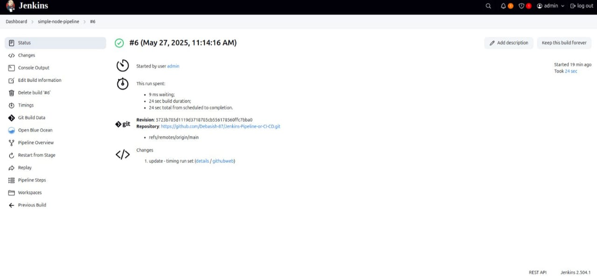
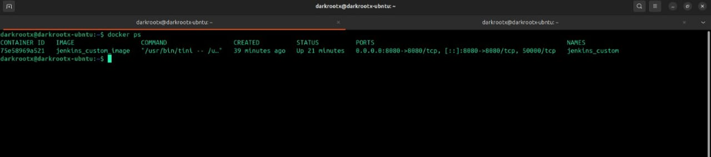

# Jenkins Pipeline CI/CD Project with Docker 🚀


---

## 📑 Table of Contents

- [Project Overview](#-project-overview)
- [Features](#-features)
- [Tools Used](#-tools-used)
- [Project Structure](#-project-structure)
- [Setup Instructions](#️-setup-instructions)
- [Pipeline Stages](#-pipeline-stages)
- [Screenshots](#-screenshots)
- [Interview Questions](#-interview-questions)
- [Acknowledgments](#-acknowledgments)
- [Contact](#-contact)

---

## 🚀 Project Overview

This project demonstrates a simple **Jenkins pipeline** that automates the build, test, and deployment of a **Node.js application** using Docker. It simulates a typical **DevOps CI/CD workflow**, where code changes trigger automated steps, ensuring faster and more reliable delivery.

---

## 📋 Features

✅ Automated build of Node.js application  
✅ Run automated tests  
✅ Deployment stage (customizable)  
✅ Integration with GitHub repository to trigger pipeline on each commit  
✅ Dockerized Jenkins setup for easy environment management

---

## 🛠️ Tools Used

- **Jenkins** – Automation server to run CI/CD pipelines  
- **Docker** – Container platform for running Jenkins and the application  
- **Node.js** – JavaScript runtime for app development  
- **GitHub** – Source code management and pipeline trigger

---

## 📁 Project Structure

```

/
├── Jenkinsfile                  # Pipeline definition file
├── Dockerfile                   # Dockerfile for Jenkins or app (optional)
├── app.js                       # Sample Node.js application
├── package.json                 # Node.js dependencies and scripts
├── README.md                    # This documentation file
└── images/                      # Folder containing screenshots
├── jenkins\_pipeline\_success.png
└── docker\_run\_jenkins.png

````

---

## ⚙️ Setup Instructions

1️⃣ **Clone the repository:**

```bash
git clone https://github.com/Debasish-87/Jenkins-Pipeline-or-CI-CD.git
cd Jenkins-Pipeline-or-CI-CD
````

2️⃣ **Run Jenkins using Docker:**

```bash
docker run -p 8080:8080 -p 50000:50000 -v jenkins_home:/var/jenkins_home jenkins/jenkins:lts
```

3️⃣ **Access Jenkins UI:**

* Open [http://localhost:8080](http://localhost:8080) in your browser
* Complete the initial setup and install recommended plugins

4️⃣ **Create a Pipeline Job in Jenkins:**

* Connect to your GitHub repository URL
* Use the existing `Jenkinsfile` in the repo to define pipeline stages

5️⃣ **Trigger the Pipeline:**

* Commit and push changes to GitHub
* Jenkins will automatically trigger build, test, and deploy stages

---

## 🏃 Pipeline Stages

| Stage        | Description                                 |
| ------------ | ------------------------------------------- |
| **Checkout** | Pull source code from GitHub                |
| **Build**    | Install dependencies using `npm install`    |
| **Test**     | Run tests using `npm test`                  |
| **Deploy**   | Custom deployment logic (can be customized) |
| **Archive**  | Archive build artifacts or outputs          |

---

## 🖼️ Screenshots

### Jenkins Pipeline Successfully Built, Tested, and Deployed


*Jenkins pipeline successfully completed all stages.*

---

### Jenkins Pipeline Successfully Built, Tested, and Deployed Status


*Jenkins pipeline successfully completed all stages.*

---

### Docker Running Jenkins Container


*Jenkins running inside a Docker container.*

---


## 💡 Interview Questions

**1️⃣ What is Jenkins, and how is it used in CI/CD?**
Jenkins is an open-source automation server used to automate software build, test, and deployment processes as part of CI/CD pipelines.

**2️⃣ What is a Jenkinsfile?**
A Jenkinsfile is a text file that contains the definition of a Jenkins pipeline, written using Declarative or Scripted Pipeline syntax.

**3️⃣ How do you create and configure Jenkins pipelines?**
Pipelines are created by defining a Jenkinsfile in your source repository and configuring a Jenkins job to point to that repo. Jenkins executes pipeline stages automatically on code changes.

**4️⃣ What are some common stages in a Jenkins pipeline?**
Typical stages include Checkout, Build, Test, Deploy, and Post-build actions.

**5️⃣ What is the difference between declarative and scripted Jenkins pipelines?**
Declarative pipelines offer a simpler, more readable syntax with predefined structure, ideal for common use-cases. Scripted pipelines provide full flexibility using Groovy scripting for advanced workflows.

---

## 🙏 Acknowledgments

Special thanks to the **Jenkins** and **Docker** communities for providing excellent tools that simplify DevOps workflows.

---

## 📬 Contact

For questions or suggestions, feel free to reach out:
👤 **Debasish Mohanty**
📧 [debasishm8765@gmail.com](mailto:debasishm8765@gmail.com)
🔗 [GitHub Profile](https://github.com/Debasish-87)

---

✨ *Happy CI/CD-ing!* 🎉

```

